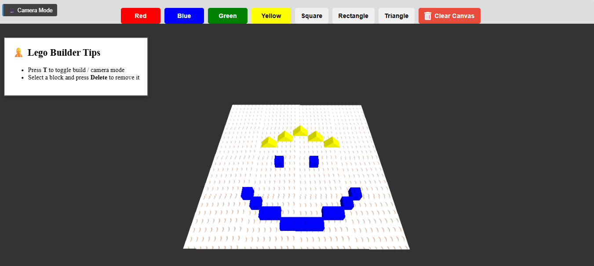

# Senior Capstone Project: Lego-Builder 🧱

## Overview

This is a 3D Lego building project built with JavaScript and Three.js.  
It lets you drag, stack, and snap together Lego-like blocks on a grid inside the browser.



## 💻 Features

- Drag and drop Lego blocks on a 2D grid
- Snap blocks together into groups
- Stack triangles, rectangles, and squares
- Simple gravity and collision detection
- Real-time updates using Three.js

## 🚀 How to Run

The easiest way to run this project is using **Visual Studio Code** and the **Live Server** extension.

### Prerequisites

✅ Install [Visual Studio Code](https://code.visualstudio.com/)  
✅ Install the **Live Server** extension for VS Code  
✅ Clone or download this repository to your computer

### Steps to Run

1. Open the project folder in Visual Studio Code.

2. Install the Live Server extension if you haven’t already:

   - Go to the **Extensions** tab (`Ctrl+Shift+X`)
   - Search for `Live Server` by Ritwick Dey
   - Click **Install**

3. Right-click the `index.html` file in the project and select:
   **"Open with Live Server"**

4. Your default web browser will open and display the Lego building app.

---

## 📦 Project Dependencies

This project uses:

- `three` → For 3D rendering
- `jest` → For testing (optional, only if you want to run tests)

**Note:** You don’t need to run `npm install` unless you plan to modify the code or run tests.

---

## 🧪 Running Tests (optional)

If you want to run the test suite:

1. Make sure you have [Node.js](https://nodejs.org/) installed.

2. In the terminal, navigate to the project folder and run:

   ```bash
   npm install
   npm test
   ```
